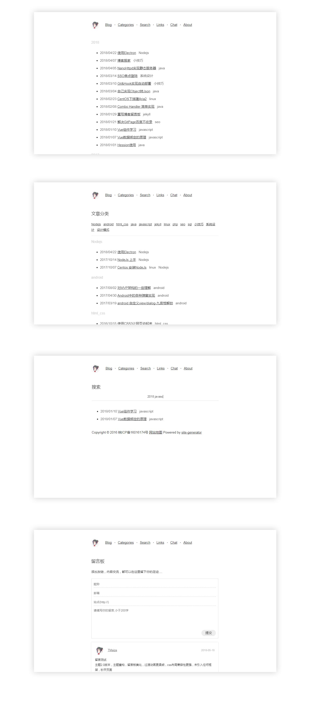
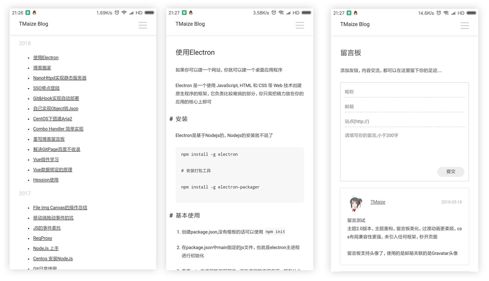

# 介绍

一款jekyll主题，简洁纯净，支持自适应

2.0版本，主题重构，留言板美化，过渡动画更柔顺，css布局兼容性更强，未引入任何框架，秒开页面

如果你喜欢用Java，该主题同时提供[site-generator](https://github.com/TMaize/site-generator)版本，


下面有具体的样式截图，或者你可以到我的博客查看

[我的Blog预览](http://blog.tmaize.net/) 欢迎添加友链

[github 地址](https://github.com/TMaize/tmaize-blog) 欢迎star

# 使用

使用的话请参考我的文件放置规则，文章放在_posts目录，文章资源放在posts目录

请删除_includes/footer.html里面的统计代码

CNAME文件里的内容请换成你自己的域名

配置文件

```
encoding: utf-8

# seo
title: TMaize'Blog
description: TMaize'Blog
keywords: TMaize,Blog,TMaize'Blog
author: TMaize

# 上下文环境，"","/blog"
context: ""
# 用于生成sitemap
"siteMapPrefix": "http://blog.tmaize.net"

## 文章url前缀
permalink: /posts/:year/:month/:day/:title.html

copyright: 2016
record: "皖ICP备16016174号"

coderay:
  coderay_tab_width: 4
```


# PC端截图



# 移动端截图


