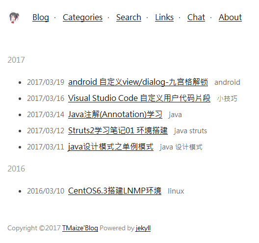
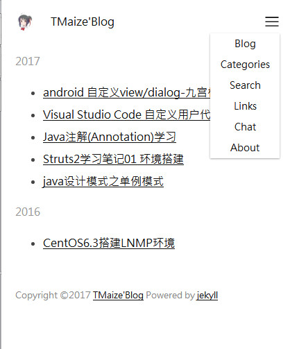

# 地址

 [我的Blog预览](http://blog.tmaize.net/)

 [github 地址](https://github.com/TMaize/tmaize-blog)

# 说明

一款jekyll主题，简洁纯净，支持自适应

由于一直在这个项目里面修改主题代码，和以前的项目simple-jekyll-theme差异太大，现在把simple-jekyll-theme删除了，只留这一个项目，以后会开一个theme分支

 
# 截图





# 使用

## 配置说明

```
encoding: utf-8

# seo
title: TMaize'Blog
description: TMaize'Blog
keywords: TMaize,Blog,TMaize'Blog
author: TMaize

# 上下文环境，"","/blog"
context: ""
scheme: "http"
domain: "blog.tmaize.net"

## 文章url前缀
permalink: /posts/:year/:month/:day/:title.html

copyright: 2016
beianhao: "皖ICP备16016174号"

coderay:
  coderay_tab_width: 4
```


## 写文章

符合 jekyll 的使用规范

文章放在_posts目录

文章资源放在posts目录

## 要修改的文件

+ _includes/footer.html

    请把百度和360的seo推送代码替换或者删除

+ pages/chat.html

    请把多说的评论替换或者删除

+ CNAME

    如果支持cname请换成你自己的域名


